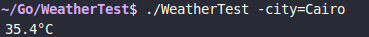

# WeatherTest

A simple command-line tool to fetch and display current temperature for a given city using the OpenWeatherMap API.

# Basic Usage
 ```
 ./WeatherTest -city=cityname
 ```
 Replace cityname with a city of your choice

 
   <br>
 (You can clearly tell that this application was written during the Egyptian summer)<br>
 and it outputs the current temperature in Celsius

 # Requirments
 The application requires an OpenWeatherMap API key stored in either:

   - A .env file in the project root (recommended for development)

   - Your system's environment variables
